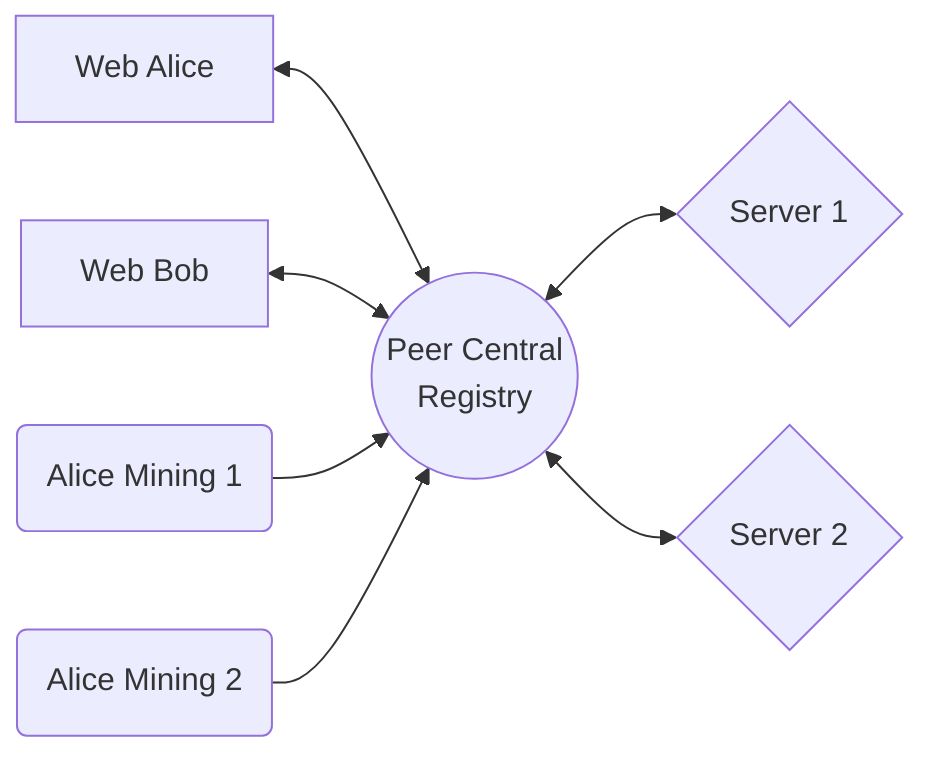

```mermaid
  graph LR
    A[Web Alice] <--> B((Peer Central 
    Registry))
    C[Web Bob] <--> B((Peer Central 
    Registry))
    
    B <--> D{Server 1}
    B <--> E{Server 2}

    F(Alice Mining 1) --> B((Peer Central 
    Registry))
    G(Alice Mining 2) --> B((Peer Central 
    Registry))
    
```
